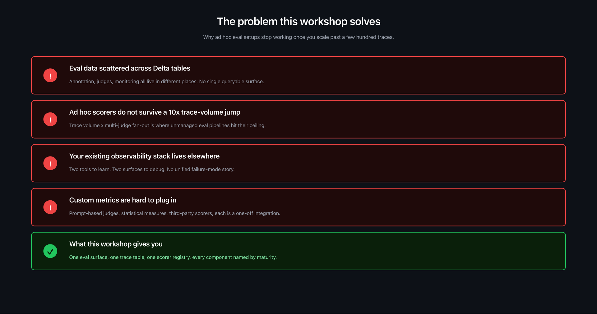
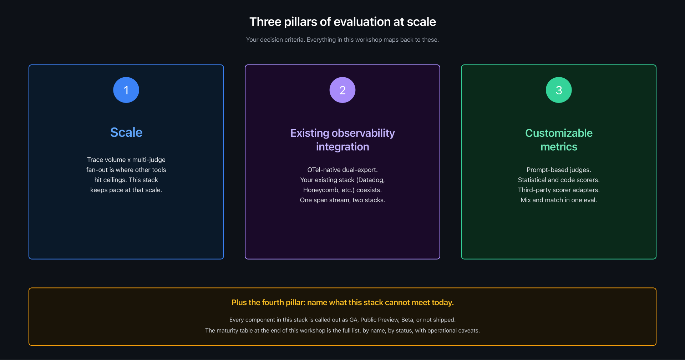
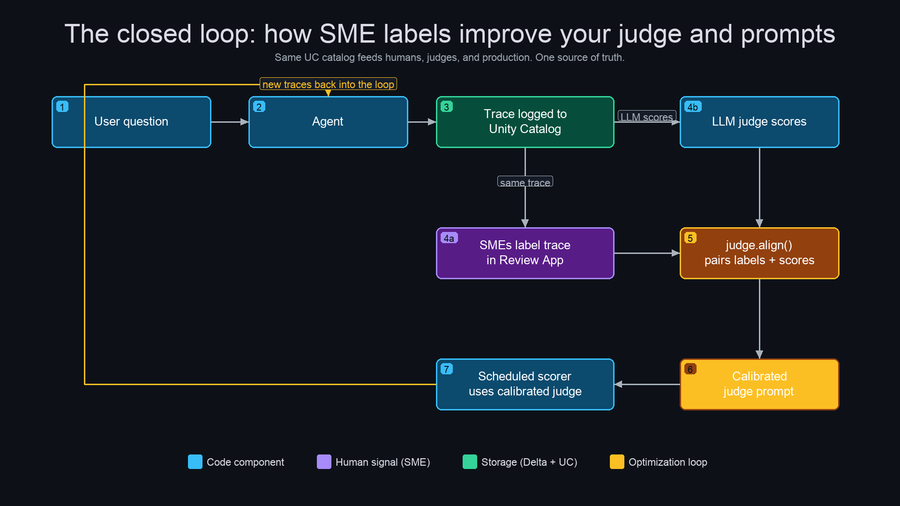
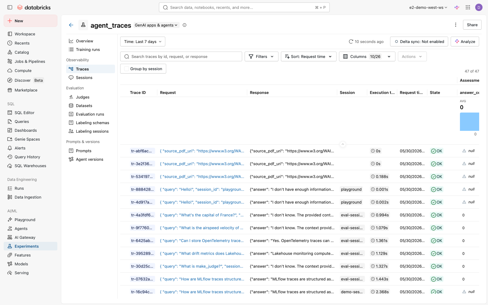
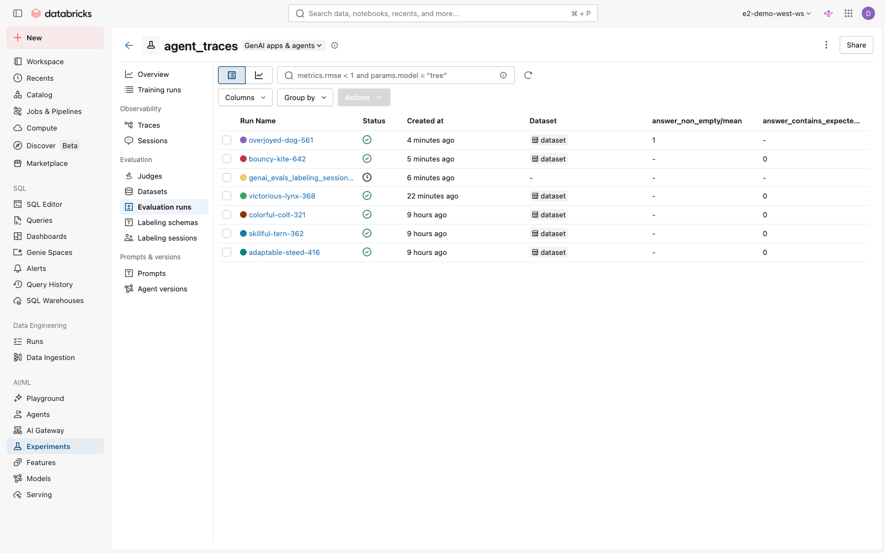
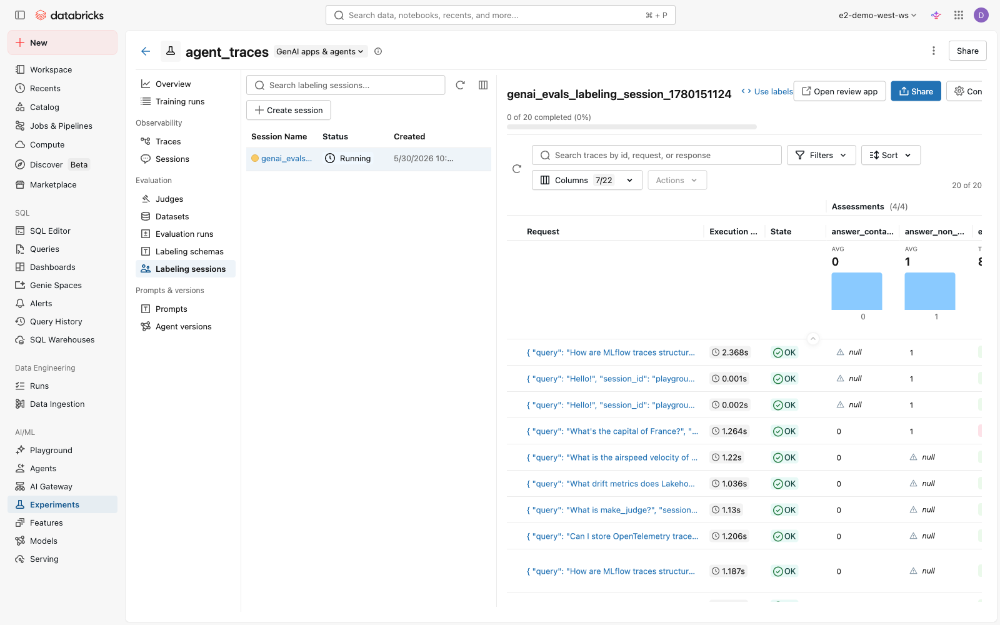
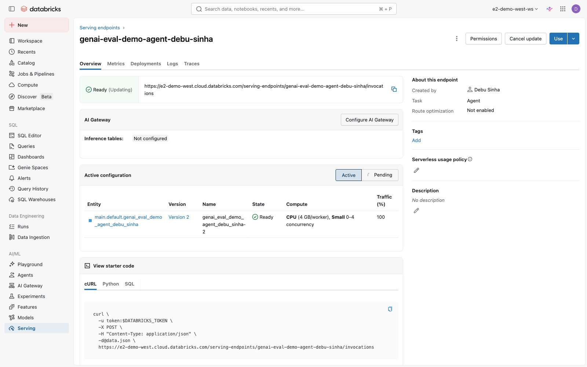

# GenAI Evaluation Workshop on Databricks

End-to-end evaluation workshop for production GenAI agents on Databricks. Covers tracing, scorers, LLM judges, judge alignment against SME labels, scheduled production monitoring, OTel Traces in Unity Catalog, deployed agents with AI Playground routing, custom annotation apps for PDF-grounded review, and versioned judges via the Prompt Registry.

Eight runnable notebooks plus a configuration notebook. All cells run on Serverless. No cluster setup, no DAB deploy, no extra packages. Clone this repo into your workspace and run them in order.

---

## Start here

If you have 90 minutes and want to see the whole loop run on your workspace:

1. Import this folder into your Databricks workspace.
2. Open `notebooks/00_introduction` and read the framing.
3. Run notebooks in order: `01` -> `02` -> `03` -> `04` -> `05` -> `06` -> `07` -> `99`.
4. Each notebook prints what to verify in the workspace at the end.

If you have 20 minutes and want to see one thing end to end:

- Run `01_agent_app` then open the experiment Traces tab to see structured span trees with session and user filtering.

If you want the production deployment pattern only:

- Read `06_deploy_agent` for the three-env-var routing fix that gets AI Playground traces into the same experiment as your offline evals.

---

## What this workshop addresses



Most teams already have an ad hoc eval setup. It works at a few hundred traces. Then it breaks at production scale.

## The three pillars

Three principles tie every notebook together.



## The closed loop

User question -> traced agent -> trace in UC -> SME labels in Review App + LLM judge scores -> `judge.align` -> calibrated judge -> scheduled scorer -> new traces back into the loop. Same UC catalog feeds humans, judges, and production.



---

## The notebooks

| # | Notebook | What it shows | Status |
|---|---|---|---|
| 00 | `00_introduction` | Framing layer, no code. Problem, pillars, closed-loop overview. | runnable, no compute |
| 01 | `01_agent_app` | Small RAG agent with `@mlflow.trace` decorators producing hierarchical span trees, session and user metadata for UI filtering. | runs end to end |
| 02 | `02_capture_assessments` | Two human-signal channels: in-app thumbs feedback via `log_feedback`, structured SME labeling via Review App with typed schemas. | runs end to end |
| 03 | `03_offline_evals` | `mlflow.genai.evaluate` over a golden dataset, code-based `@scorer` and `make_judge` LLM judge, `judge.align(optimizer=MemAlign)` to calibrate the judge against SME labels, agreement-lift measurement, register the calibrated judge for production. | runs end to end |
| 04 | `04_production_monitoring` | Backfill scoring with `mlflow.genai.evaluate(data=traces)`, then `scorer.register().start(sampling_config=...)` for continuous scheduled scoring at fixed sample rates. | runs end to end |
| 05 | `05_otel_uc_integration` | Three trace surfaces (MLflow API, SQL, dual-export to existing observability tools), the canonical OTel dual-export pattern, multimodal trace support roadmap, the maturity statement closing the demo. | runs end to end |
| 06 | `06_deploy_agent` | Wrap the agent as `mlflow.pyfunc.ChatModel`, register in Unity Catalog, create Mosaic AI Model Serving endpoint. Three env vars route AI Playground call traces back into the same experiment as the offline evals. | runs end to end |
| 07 | `07_custom_annotation_app` | Skeleton for a custom Databricks App that renders source PDFs and parsed markdown side by side for SME review, writes feedback back via `log_feedback`. | runs end to end |
| 99 | `99_register_judge_prompt_versions` | Push baseline and aligned judge prompts to the UC Prompt Registry with commit messages and tags. Diff view, version pinning by alias, production load pattern. | runs end to end |

99 is optional. We numbered it that way to keep it out of the main flow.

---

## Prerequisites for end-to-end execution

| Requirement | Why | Where to verify |
|---|---|---|
| Databricks workspace with managed MLflow 3 | Tracing, scorers, judges, judge.align | Settings -> About -> MLflow version (3.x required, 3.10+ recommended for native multi-turn) |
| Serverless compute enabled for notebooks | All cells run on serverless | Compute -> Serverless tab |
| Unity Catalog enabled for the workspace | Model registry in notebook 06, UC schema for notebook 99 | Catalog Explorer |
| Foundation Model API access | LLM judges, agent inference | `databricks-claude-sonnet-4-6` endpoint reachable |
| Optional: OTel + Traces in Unity Catalog Preview | SQL access to traces in notebook 05 | Admin -> Previews -> "OpenTelemetry on Databricks" + "Variant Shredding" |
| Optional: Model Serving | Notebook 06 deploys an endpoint | Workspace -> Serving |

If you skip the optional items, notebooks 05 and 06 still run but some cells stay illustrative rather than live.

---

## How to run

Three paths. Pick whichever fits how your team usually pulls code into the workspace. All three were tested against the verification workspace listed in `docs/verification.md`.

**Path 1: Databricks Repos (recommended, no CLI, no download)**

In the workspace sidebar, click **Workspace** > **Repos** > **Add Repo**. Paste:

```
https://github.com/debu-sinha/scribd-evaluation-workshop
```

Pick `main` as the branch. The folder lands under `/Workspace/Repos/<your-user>/scribd-evaluation-workshop/`. Open `notebooks/00_introduction` from there and run them in order.

This is the path the verification job runs against. If your workspace has git provider integration set up, this is also the path that lets you `Pull` updates later.

**Path 2: ZIP import via GUI**

Use this if your workspace doesn't have GitHub configured under Settings > Linked accounts.

1. On GitHub, click **Code** > **Download ZIP**.
2. In your Databricks workspace, right-click your user folder > **Import** > **File** > upload the ZIP.
3. Open `notebooks/00_introduction` from the imported folder and run them in order.

**Path 3: CLI import-dir**

For CI workflows or workspace setup scripts.

```bash
git clone https://github.com/debu-sinha/scribd-evaluation-workshop.git
databricks workspace import-dir \
  scribd-evaluation-workshop/notebooks \
  /Workspace/Users/$USER/genai-evaluation-workshop \
  --profile <your-profile>
```

Open `/Workspace/Users/$USER/genai-evaluation-workshop/00_introduction` in the workspace.

---

## What each notebook produces

Every resource the notebooks create is namespaced by user. Two engineers on the same team can run this in the same workspace without stepping on each other. After running the full sequence, your workspace has:

- One MLflow experiment at `/Workspace/Users/<you>/genai_evals_demo/agent_traces` with about 25 traces from notebook 01
- A Review App labeling session with typed schemas for groundedness, relevance, rationale
- One offline evaluation run with per-row scores from a code scorer and an LLM judge
- One calibrated `relevance` judge registered as a scorer on the experiment
- Two scheduled scorers (cheap structural check at 100 percent sampling, LLM judge at 10 percent sampling)
- One Model Serving endpoint hosting the agent at `genai-eval-demo-agent-<your-user-slug>` with three env vars routing AI Playground traces back into the same experiment
- One UC-registered model at `main.default.genai_eval_demo_agent_<your-user-slug>`
- Two versioned prompts in the UC Prompt Registry under a schema you own (auto-detected from `system.information_schema.schemata`)

## Per-user resource map

| Resource | Scoping | Override in |
|---|---|---|
| MLflow experiment path | `/Workspace/Users/<you>/genai_evals_demo/agent_traces` | nb01-07: `EXPERIMENT_PATH` |
| Review App labeling session name | `genai_evals_labeling_session_<timestamp>` | per-run unique, no override needed |
| UC model name | `main.default.genai_eval_demo_agent_<user_slug>` | nb06: `MODEL_NAME` |
| Serving endpoint name | `genai-eval-demo-agent-<user-slug>` | nb06: `ENDPOINT_NAME` |
| Prompt registry name | `<your_owned_schema>.relevance_judge_instructions` | nb99: `PROMPT_SCHEMA` |

If your team prefers a shared model or endpoint, override `MODEL_NAME` and `ENDPOINT_NAME` in nb06's config block to your team's chosen value. If you're an admin and want all team members landing under one prompt schema, override `PROMPT_SCHEMA` in nb99.

---

## Coming from LangSmith

If your current setup is LangSmith for tracing and a Delta table for batch eval datasets, here is what maps to what.

| LangSmith | This workshop |
|---|---|
| `langsmith` client + `@traceable` decorator | `@mlflow.trace` decorator + `mlflow.update_current_trace` for session and user metadata |
| LangSmith Datasets | Pandas DataFrame or Delta table passed to `mlflow.genai.evaluate(data=...)` |
| LangSmith Evaluators | `@scorer` decorator for code, `make_judge` for LLM judges, third-party adapters for RAGAS, DeepEval, Phoenix, TruLens, Guardrails |
| LangSmith Online Eval | `scorer.register(name).start(sampling_config=ScorerSamplingConfig(...))` |
| Annotation queues | Review App labeling sessions + custom Databricks App (notebook 07) for PDF-grounded review |
| Prompt Hub | UC Prompt Registry (notebook 99) with versioned prompts, commit messages, tags, alias-based pinning |

The big difference is that traces and assessments are Delta tables in Unity Catalog. SQL warehouses, Genie, AI/BI dashboards, and Lakehouse Federation all read the same data the MLflow UI shows.

---

## Already running evals on Delta tables

If your batch eval pattern today is "run inference, save outputs to a Delta table, score offline," the pattern translates directly:

```python
import mlflow

# Your existing Delta table
eval_df = spark.table("your.catalog.eval_dataset").toPandas()

# Run scorers against it - no agent re-run needed
results = mlflow.genai.evaluate(
    data=eval_df,            # inputs + outputs already populated
    scorers=[answer_contains_keyword, relevance_judge],
)
```

Notebook 03 walks through this exact pattern. `mlflow.genai.evaluate` doesn't care whether outputs came from a live agent or a pre-computed Delta table.

---

## What the workspace looks like

After running the full sequence, here is what each surface shows. All screenshots taken from the verification workspace.

### Traces tab - what notebook 01 produces



25 traces in the experiment, each with session and user metadata flowing into trace fields. The Assessments column on the right surfaces the `answer_non_empty/mean` value the scorers wrote back.

### Evaluations tab - what notebook 03 produces



One evaluation run per `mlflow.genai.evaluate` call. The columns show per-row scores from the code-based scorer and the LLM judge.

### Labeling sessions - what notebook 02 produces



A typed Review App session with 20 traces queued for SME annotation. Each trace's assessment progress is tracked per reviewer.

### Serving endpoint - what notebook 06 produces



The deployed agent at `genai-eval-demo-agent-<your-user-slug>`. Active configuration shows the served entity, the three env vars route AI Playground call traces back into the experiment.

### Prompt Registry (manual step)

The Prompt Registry surface in the experiment Prompts tab does not auto-discover prompts your notebooks register. To see the two prompt versions notebook 99 creates, click **Select a schema** in the top-right of the Prompts tab, pick the schema notebook 99 printed (default: `users.<your-user>`), and confirm. The Databricks UI displays this requirement on the schema-selector dialog itself.

### Production monitoring

Scheduled scorers registered by notebook 04 show up in the experiment's Monitoring view. The URL pattern moved recently in the Databricks UI, so the cleanest way to find them is via the experiment sidebar.

## Diagrams

All diagrams are Excalidraw source plus rendered PNG, both committed under `notebooks/images/`. To edit, open the `.svg` in Excalidraw and re-render the PNG.

| Diagram | Where it appears |
|---|---|
| `hd_problem.png` | Notebook 00, README |
| `hd_three_pillars.png` | Notebook 00, README |
| `hd_loop_diagram.png` | Notebook 03, README |
| `hd_offline_evals_concept.png` | Notebook 03 |
| `hd_production_monitoring_concept.png` | Notebook 04 |
| `hd_otel_uc_integration_concept.png` | Notebook 05 |
| `hd_scorer_pattern.png` | Notebook 03 |
| `hd_custom_annotation_app_concept.png` | Notebook 07 |

---

## Verification

Tested end to end on Databricks Serverless against the workspace listed in `docs/verification.md`. If a notebook fails for you, the usual causes are:

1. **Foundation Model API rate limit** on shared workspaces. Notebook 03 catches `REQUEST_LIMIT_EXCEEDED` and falls back to the unaligned judge.
2. **Missing UC privileges** for the Prompt Registry in notebook 99. The notebook auto-detects a UC schema you own. If you don't own any schema, set `PROMPT_SCHEMA` explicitly or have a metastore admin grant `CREATE FUNCTION` on a schema to your user.
3. **First-time endpoint provisioning** in notebook 06 takes 5 to 15 minutes. Re-runs are fast.

---

## License

MIT. See `LICENSE`.

---

## Authors

Built by [Debu Sinha](https://github.com/debu-sinha) as part of the Databricks Field Engineering MLflow GenAI evaluation track. The PDF-annotation app and judge-versioning patterns in notebooks 07 and 99 came out of work with the Scribd team.

Questions or suggestions? Open an issue on this repo or reach out via Slack.
